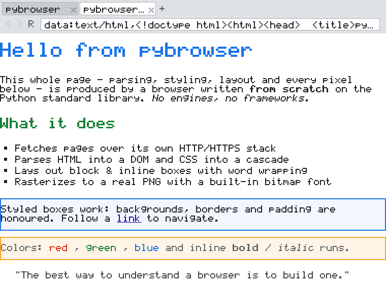
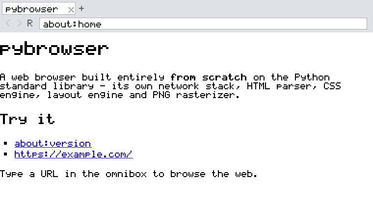
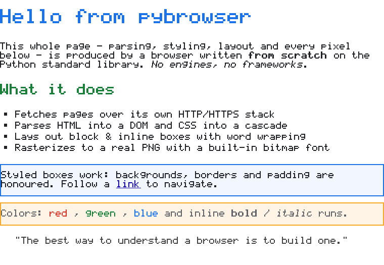

# pybrowser

A web browser like Google Chrome, built **entirely from scratch** on the
Python standard library. There is no rendering engine, no GUI toolkit, no
`requests`, no Pillow — **zero third-party dependencies**. pybrowser writes
its own network stack, HTML parser, CSS engine, layout engine, and even its
own **PNG encoder and bitmap font** so it produces real, pixel-rendered
screenshots.



*Everything above — the tab strip, the omnibox, and every pixel of the page —
is drawn by pybrowser itself.*

## Why "from scratch"?

Chrome is ~30 million lines of C++. pybrowser is a few thousand lines of
Python, but it implements the same *pipeline* a real browser uses, so you can
read it end to end and understand how a browser actually works:

```
URL ──▶ Network ──▶ HTML Parser ──▶ CSS Engine ──▶ Layout ──▶ Paint ──▶ Raster ──▶ PNG
        (sockets)     (DOM tree)      (cascade)     (boxes)  (display   (framebuffer)
                                                              list)
```

Each stage is a small, self-contained module:

| Module | Responsibility |
| --- | --- |
| `pybrowser/url.py` | Network stack over raw `socket` + `ssl`: `http`, `https` (with `CONNECT`-proxy support), `file`, `data`, `about`; redirects, gzip, chunked transfer |
| `pybrowser/html_parser.py` | Forgiving HTML tokenizer + DOM tree builder (implicit tags, void elements, entities) |
| `pybrowser/css.py` | CSS parser, selector matching, specificity, the cascade, and inheritance, plus a user-agent stylesheet |
| `pybrowser/layout.py` | Block + inline layout engine: the box model, word wrapping, list markers, links |
| `pybrowser/paint.py` | A display list of drawing commands (decoupled from layout for scrolling) |
| `pybrowser/fonts.py` | A hand-drawn 5×7 bitmap font for printable ASCII + typographic glyphs |
| `pybrowser/raster.py` | Software rasterizer + a **from-scratch PNG encoder** (only `zlib` is used) |
| `pybrowser/browser.py` | Tabs, back/forward history, and Chrome-like window chrome |
| `pybrowser/cli.py`, `tui.py` | A command line and an interactive terminal browser |

## Requirements

Python 3.8+. **That's it** — nothing to `pip install`.

## Quick start

```bash
# Render a page to a PNG (with the browser chrome), full page height:
python -m pybrowser render https://example.com -o example.png --full

# Render just the page content, no browser UI:
python -m pybrowser render file://$PWD/examples/sample.html -o page.png --no-chrome --full

# Print a page as plain text (great for a headless terminal):
python -m pybrowser text about:home

# ASCII-art preview of a page in your terminal:
python -m pybrowser ascii about:version --cols 80

# Launch the interactive terminal browser:
python -m pybrowser            # or: python -m pybrowser repl
```

### The interactive terminal browser

Because a graphical window needs a display, pybrowser also drives from the
terminal — the same engine, rendered to text with numbered links:

```
pybrowser> about:home           # navigate to a URL
pybrowser> 0                    # follow link #0
pybrowser> back                 # history back        (also: forward, reload)
pybrowser> links                # list the links on the page
pybrowser> newtab about:version # open a new tab      (also: tabs, tab <n>, close)
pybrowser> save shot.png        # save a PNG screenshot of the current view
pybrowser> help
pybrowser> quit
```

## Using it as a library

```python
from pybrowser.browser import Browser

browser = Browser(width=800, height=600)
browser.new_tab("about:home")
browser.new_tab("https://example.com")
browser.screenshot().save_png("shot.png")     # a real PNG, written by pybrowser
```

Or drive the pipeline directly:

```python
from pybrowser.html_parser import parse_html
from pybrowser.css import default_rules, CSSParser, extract_stylesheets, style
from pybrowser.layout import DocumentLayout
from pybrowser.paint import paint_visible
from pybrowser.raster import Canvas

html = "<h1 style='color:teal'>Hi</h1><p>Hello, <b>world</b>!</p>"
root = parse_html(html)
rules = default_rules() + CSSParser(extract_stylesheets(root)).parse()
style(root, rules)                        # cascade + inheritance
doc = DocumentLayout(root, width=400)
doc.layout()                              # build the box tree
canvas = Canvas(400, int(doc.height))
paint_visible(doc.display_list, 0, canvas)
canvas.save_png("hi.png")
```

## What it supports

- **Networking**: `http`/`https` over raw sockets and TLS, HTTP proxies via
  `CONNECT` (honours `HTTPS_PROXY`), 3xx redirects, `gzip`, and chunked
  transfer encoding; plus `file:`, `data:` and `about:` URLs.
- **HTML**: a tolerant parser that inserts missing `<html>`/`<head>`/`<body>`,
  auto-closes mis-nested tags, understands void elements and implied end tags,
  and decodes named/numeric character references.
- **CSS**: type, class, id, universal, compound (`p.note`) and descendant
  (`#main p`) selectors; specificity and source-order cascade; inheritance;
  inline `style=""`; `font` shorthand; a built-in user-agent stylesheet.
- **Layout**: block and inline formatting, the box model (margins, padding,
  borders), word wrapping, `text-align`, `display:none`, list markers,
  headings, `<pre>`, and relative/`em`/`%` font sizes.
- **Rendering**: colored text (named, `#rgb`, `#rrggbb`, `rgb()`), bold and
  italic, backgrounds, borders, links (underlined), scrolling, and multi-tab
  window chrome — all rasterized to PNG.

## Example renders

The built-in start page (`about:home`):



A full-page content capture (no chrome):



All three images are produced by `python examples/demo.py`, which uses nothing
but pybrowser itself.

## Tests

```bash
python -m unittest discover -s tests -v
```

33 tests cover the parser, CSS cascade, URL handling, the font/rasterizer,
the layout engine, and the browser/tab/history logic.

## Architecture notes & limitations

pybrowser is a faithful *miniature* of a real browser, not a replacement for
one. It deliberately stops short of JavaScript, the full CSS box model
(floats, flexbox, grid), incremental/GPU compositing, and images. The goal is
a complete, readable rendering pipeline you can hold in your head — from a URL
string all the way down to individual pixels in a PNG.

## Project layout

```
pybrowser/          the engine (one module per pipeline stage)
tests/              unittest suite (no third-party runner)
examples/demo.py    generates the screenshots in docs/
docs/               generated screenshots
```
